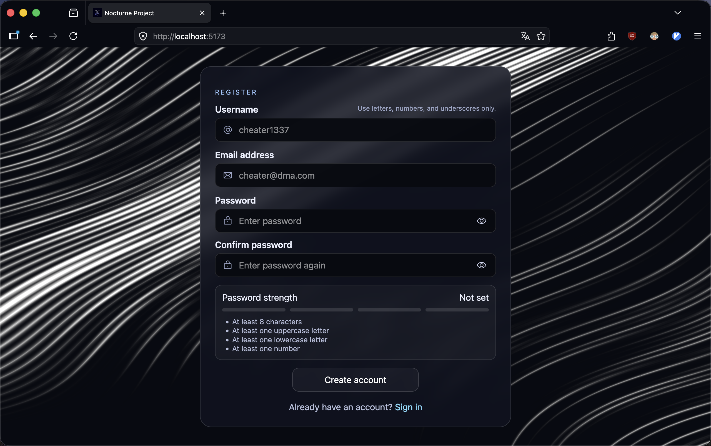
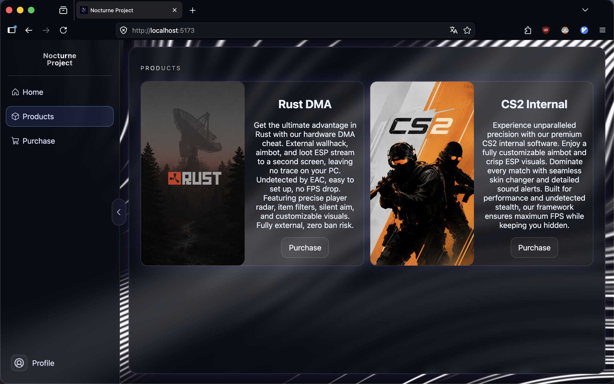
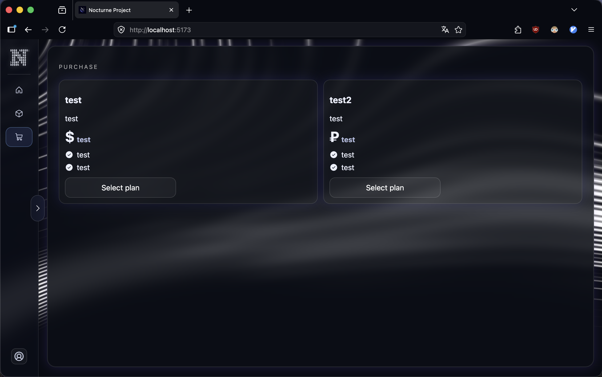
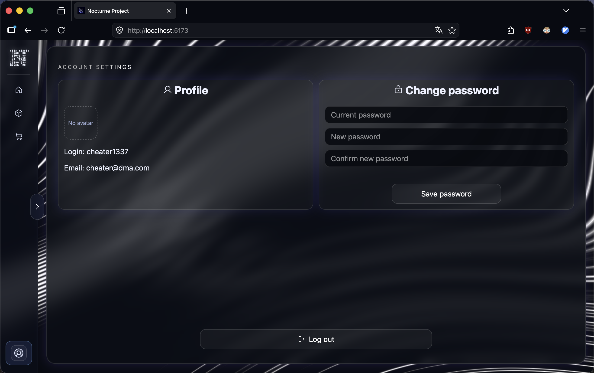

<h1>Nocturne.wtf</h1>

<h3>The website is currently under development, there is no backend, but it will be soon.</h3>

<h2>Preview:</h2>

<h2>To run it locally with npm:</h2>
<pre><code>git clone https://github.com/dehashednotavailable/nocturne.wtf.git
cd nocturne.wtf
npm install
npm run dev</code></pre>

